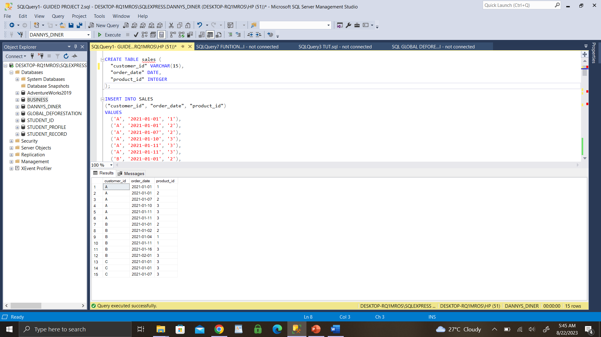
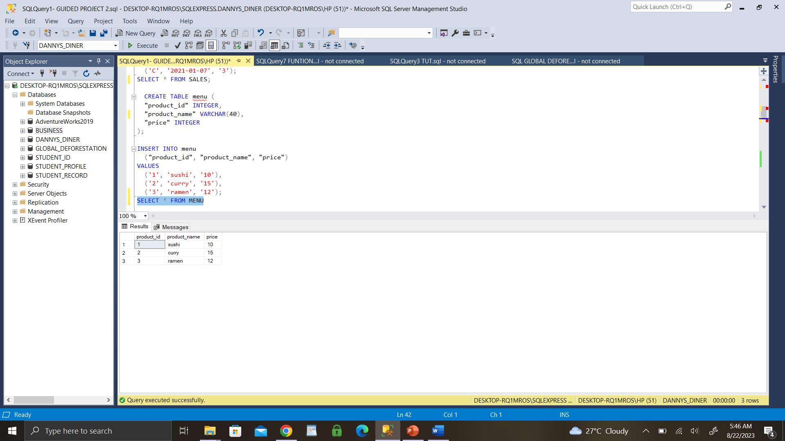
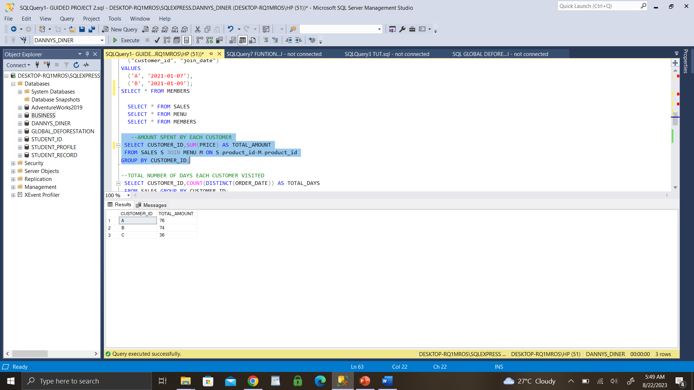
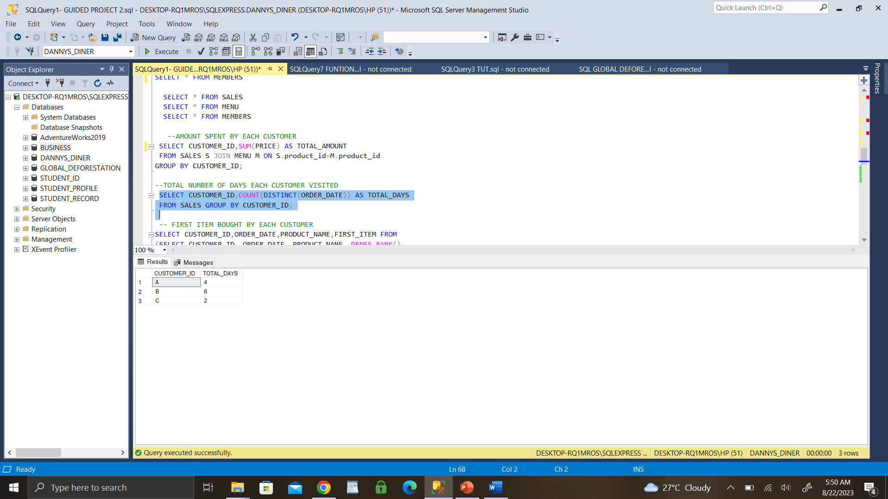
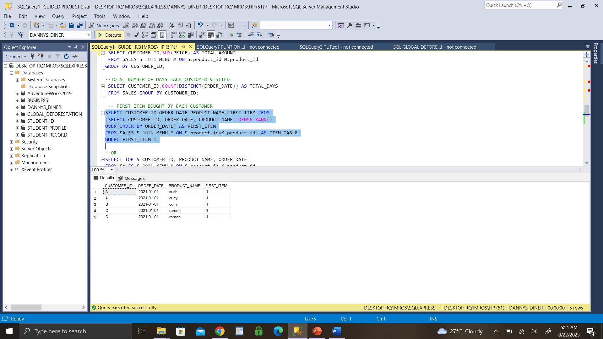
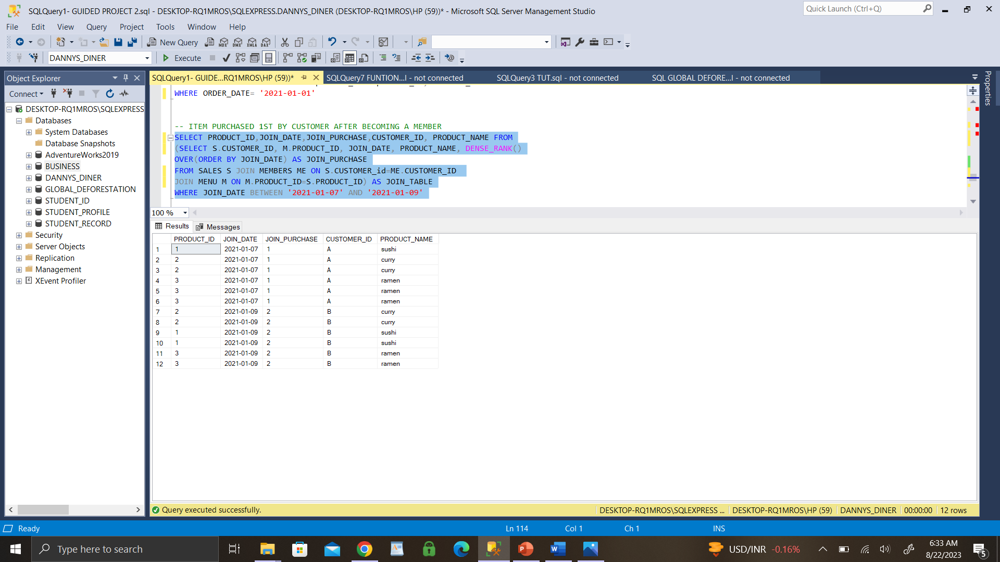
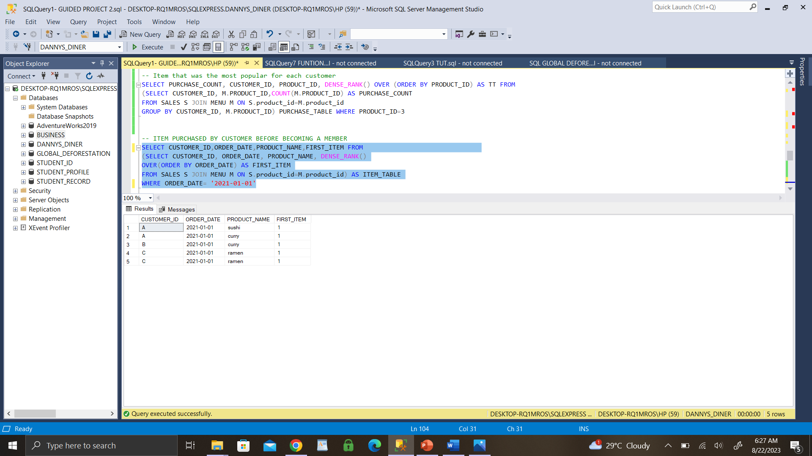

# SQL-PROJECT-01
Showcasing how to create/analyze Data from a Database

## Introduction
This is an SQL project which aim is to show how to create,manage and analysis of data from a database. 

**_Disclaimer_**: _All datasets do not represent any company, institution or country, this is just a dummy dataset to demonstrate use of SQL_.
---
## Problem statement
1. Create a Database named "Dannys Diner"
2. Create the following tables in the database Dannys Diner
   -  Sales (Customer ID, Order date, Product ID)
   -  Menu (Product ID, Product name, Price)
   - Members (Customer ID, Join date)
3. _What is the total amount each customer spent at the restaurant?_
4. _How many days has each customer visited the restaurant?_
5. _What was the first item from the menu purchased by each customer?_
6. _What is the most purchased item on the menu and how many times was it purchased by all customers?_
7. _Which item was the most popular for each customer?_
8. _Which item was purchased first by the customer after they became a member?_
9. _Which item was purchased just before the customer became a member?_
10. _What is the total items and amount spent for each member before they became a member?_

## Skills Demonstrated
- Creating Database, tables and Inserting values into tables
- Subqueris and joins
- Aggregation with COUNT Function
- Aggregation and filtering with GROUP BY, ORDER clause
- Sorting with ORDER BY clause
- Windows Function; used DENSE RANK () to assign rank to each row
- Analysing and making predictive decision of Data

## Solutions/Analysis
**1. Create database named 'Dannys Diner'**
I used the syntax: CREATE DATABASE DANNYS_DINER
             Then: USE DANNYS_DINER i.e make use of this Database

**2. Create and insert values tables 'Sales', 'Menu', 'Members'**

**SALES TABLE**

**MENU TABLE**

**MEMBERS TABLE**

## ANALYSIS

**3. What's the total amount each customer spent at the restaurant?**

- Started by knowing sum of the price per customer purchase in our dataset.

**4. How many days has each customer visited the restaurant?**
- This query sets further help us know the total number of days each customer visited the store;
-  this is done by counting the total days per customer ID

**5. What was the first item from the menu purchased by each customer?**
- This is carried out using DENSE RANK Function, which help us designate rank to each row; also a JOIN clause(INNER JOIN) is needed to show the relatioship between 2  different tables. 
- then we further subset the query using WHERE clause to show 1st item purchased per customer

**6A. What is the most purchased item on the menu?**
- The analysis is carried out using the COUNT clause to get the total purchase per customer, INNER JOIN our Sales and Menu table
- then using the ORDER Function to the results set of our query.

**6B. How many times was it purchased by all customers?**
- We can further determine no of times most popular item purchased by all customer by filtering the rows based on the most purchased
- using WHERE clause helps filter to show no no of times most popular purchased (i.e ITEM with Product ID: 3)

**7. Which item was the most popular for each customer?**
- This is carried out by finding the total count of item purchased per customer(using COUNT clause)
- then we subquery our main query which allows me to retrieve data that will be used as a filter on main query(i.e with the use of DENSE RANK() which assigns rank to a row and WHERE clause to filter by desire row).

**8. Which item was purchased first by the customer after they became a member?**
- This is carried out using DENSE RANK and OVER Function, which help us designate rank to each row; also a JOIN clause(INNER JOIN) joining 3 TABLES our Sales, Join Date and Menu table. 
- then we further subset the query using WHERE clause to return Join_date between '2021-01-07' and 201-01-09'.

**9. Which item was purchased just before the customer became a member?**
- This is carried out using DENSE RANK and OVER Function, which help us designate rank to each row; also a JOIN clause(INNER JOIN) joining our Sales and Menu table
- then we further subset the query using WHERE clause to return Order_date is '2021-01-01'.

**10A. What is the total items and amount spent for each customer before they became a member?**
- This query sets help us know the total Aamount spent per customer before becoing member using (SUM clause)
-  then further filter(USING WHERE CLAUSE) to show for only Order date that's before becoming a member.

